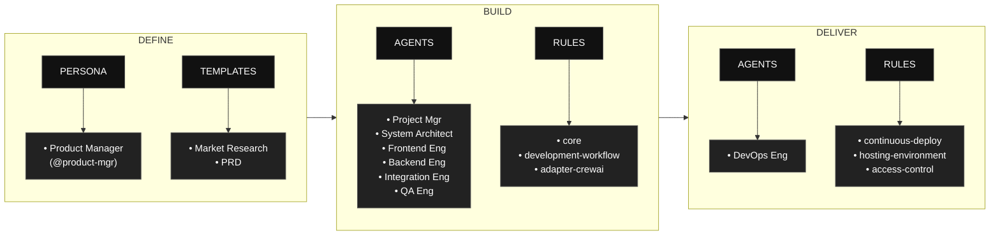

# AAMAD – AI-Assisted Multi-Agent Application Development Framework

**AAMAD** is an open, production-grade framework for building, deploying, and evolving multi-agent applications using best context engineering practices.  
It systematizes research-driven planning, modular AI agent workflows, and rapid MVP/devops pipelines for enterprise-ready AI solutions.

---

## Table of Contents

- [What is AAMAD?](#what-is-aamad)
- [AAMAD phases at a glance](#aamad-phases-at-a-glance)
- [Installation](#installation)
- [Repository Structure](#repository-structure)
- [How to Use the Framework](#how-to-use-the-framework)
- [Phase 1: Define Workflow (Product Manager)](#phase-1-define-workflow-product-manager)
- [Phase 2: Build Workflow (Multi-Agent)](#phase-2-build-workflow-multi-agent)
- [Core Concepts](#core-concepts)
- [Contributing](#contributing)
- [License](#license)

---

## What is AAMAD?

AAMAD is a context engineering framework based on best practices in AI-assisted coding and multi-agent system development methodologies.  
It enables teams to:

- Launch projects with autonomous or collaborative AI agents
- Rapidly prototype MVPs with clear context boundaries
- Use production-ready architecture/design patterns
- Accelerate delivery, reduce manual overhead, and enable continuous iteration

---

## AAMAD phases at a glance

AAMAD organizes work into three phases: Define, Build, and Deliver, each with clear artifacts, personas, and rules to keep development auditable and reusable. 
The flow begins by defining context and templates, proceeds through multi‑agent build execution, and finishes with operational delivery.



- **Phase 1 (Define):** Product Manager persona (`@product-mgr`) conducts prompt-driven discovery and context setup, supported by templates for Market Research Document (MRD) and Product Requirements Document (PRD), to standardize project scoping.

- **Phase 2 (Build):** Multi‑agent execution by Project Manager, System Architect, Frontend Engineer, Backend Engineer, Integration Engineer, and QA Engineer, governed by core, development‑workflow, and CrewAI‑specific rules.

- **Phase 3 (Deliver):** DevOps Engineer focuses on release and runtime concerns using rules for continuous deployment, hosting environment definitions, and access control.

---

## Installation

Install AAMAD from PyPI and initialize the framework for your IDE:

```bash
pip install aamad
# or
uv pip install aamad
```

### Multi-IDE support

AAMAD supports **Cursor** and **Claude Code**. Choose your IDE with the `--ide` flag:

```bash
aamad init --ide cursor        # Default: Cursor
aamad init --ide claude-code   # Claude Code
```

#### Framework feature implementation by IDE

| Feature | Cursor | Claude Code |
| :------ | :----- | :---------- |
| **Rules / instructions** | `.cursor/rules/*.mdc` with `alwaysApply: true` | `.claude/CLAUDE.md` + `.claude/rules/*.md` |
| **Rule format** | `.mdc` (YAML frontmatter + markdown body) | `.md` (plain markdown) |
| **Glob-based scoping** | ✅ `globs:` in frontmatter | ❌ Not supported (all rules loaded) |
| **Agent definitions** | `.cursor/agents/*.md` | `.claude/agents/*.md` |
| **Agent invocation** | `@agent-name` in chat | Delegation via `description`; explicit request |
| **Tool enforcement** | Instructions-based | ✅ Hard allowlist/denylist |
| **Phase 1 prompt** | `.cursor/prompts/prompt-phase-1` | `.claude/commands/phase-1-define.md` (slash command) |
| **Templates** | `.cursor/templates/` (shared) | `.cursor/templates/` (shared) |
| **Project context** | `project-context/` (shared) | `project-context/` (shared) |
| **Bridge file** | `AGENTS.md` (root) | `AGENTS.md` (root) |

---

### Cursor

**Install and initialize:**

```bash
python -m venv .venv
source .venv/bin/activate   # Windows: .venv\Scripts\activate
pip install aamad
aamad init --ide cursor --dest .
```

Or with uv:

```bash
uv venv
uv pip install aamad
uv run aamad init --ide cursor --dest .
```

**Folder structure after init:**

```
your-project/
├── .cursor/
│   ├── agents/          # Persona definitions (@product-mgr, @backend.eng, etc.)
│   ├── prompts/         # Phase-specific prompts (e.g. prompt-phase-1)
│   ├── rules/           # Always-on rules (*.mdc)
│   └── templates/      # PRD, SAD, MR templates
├── project-context/
│   ├── 1.define/        # MRD, PRD, SAD outputs
│   ├── 2.build/         # setup.md, frontend.md, backend.md, etc.
│   └── 3.deliver/       # QA logs, deploy configs
├── AGENTS.md            # Bridge file (IDE discoverability)
├── CHECKLIST.md
└── README.md
```

---

### Claude Code

**Install and initialize:**

```bash
python -m venv .venv
source .venv/bin/activate
pip install aamad
aamad init --ide claude-code --dest .
```

Or with uv:

```bash
uv venv
uv pip install aamad
uv run aamad init --ide claude-code --dest .
```

**Folder structure after init:**

```
your-project/
├── .claude/
│   ├── CLAUDE.md        # Rules summary + cross-references
│   ├── agents/          # Persona definitions (Claude Code format)
│   ├── commands/        # Slash commands (e.g. phase-1-define)
│   ├── rules/           # Individual rule files (*.md)
│   └── settings.json    # Permissions, AAMAD_ADAPTER env
├── .cursor/
│   └── templates/       # PRD, SAD, MR templates (shared)
├── project-context/
│   ├── 1.define/
│   ├── 2.build/
│   └── 3.deliver/
├── AGENTS.md
├── CHECKLIST.md
└── README.md
```

---

**CLI flags:**

- `--dest PATH` — Output directory (default: current directory)
- `--ide {cursor,claude-code}` — Target IDE (default: cursor)
- `--overwrite` — Allow replacing existing files
- `--dry-run` — Preview what would be written

Inspect bundle contents: `aamad bundle-info --verbose` or `aamad bundle-info --ide claude-code`.

---

## Repository Structure

    aamad/
    ├─ .cursor/
    │   ├─ agents/       # Agent persona definitions
    │   ├─ prompts/      # Phase-specific prompts
    │   ├─ rules/        # Architecture, workflow, epics rules
    │   └─ templates/    # PRD, SAD, MR templates
    ├─ project-context/
    │   ├─ 1.define/     # PRD, SAD, research reports
    │   ├─ 2.build/      # Setup, frontend, backend, integration, QA
    │   └─ 3.deliver/    # QA logs, deploy configs
    ├─ docs/
    ├─ CHECKLIST.md
    └─ README.md

**Framework artifacts** in `.cursor/` are the source for both Cursor and Claude Code bundles.  
**Project-context** is IDE-agnostic and shared across all IDEs.

---

## How to Use the Framework

1. **Install** (recommended): `pip install aamad` then `aamad init --ide <cursor|claude-code>`
2. **Or clone** this repository and copy `.cursor/` and `project-context/` into your project.
3. Confirm your IDE has the full agent, prompt, and rule set.
4. Follow `CHECKLIST.md` for the Define → Build → Deliver workflow.
5. Each agent persona executes its epic(s), producing markdown artifacts and code.
6. Review, test, and launch the MVP, then iterate.

---

## Phase 1: Define Stage (Product Manager)

The Product Manager persona (`@product-mgr`) conducts prompt-driven discovery and context setup to standardize project scoping:

- **Market Research:** Generate Market Research Document (MRD) using `.cursor/templates/mr-template.md`
- **Requirements:** Generate Product Requirements Document (PRD) using `.cursor/templates/prd-template.md`
- **Context Summary:** Create comprehensive context handoff artifacts for technical teams
- **Validation:** Ensure completeness of market analysis, user personas, feature requirements, and success metrics

Phase 1 outputs are stored in `project-context/1.define/` and provide the foundation for all subsequent development phases.

---

## Phase 2: Build Stage (Multi-Agent)

Each role is embodied by an agent persona, defined in `.cursor/agents/` (Cursor) or `.claude/agents/` (Claude Code).  
Phase 2 is executed by running each epic in sequence after completing Phase 1:

- **Architecture:** Generate solution architecture document (`sad.md`)
- **Setup:** Scaffold environment, install dependencies, and document (`setup.md`)
- **Frontend:** Build UI + placeholders, document (`frontend.md`)
- **Backend:** Implement backend, document (`backend.md`)
- **Integration:** Wire up chat flow, verify, document (`integration.md`)
- **Quality Assurance:** Test end-to-end, log results and limitations (`qa.md`)

Artifacts are versioned and stored in `project-context/2.build` for traceability.

---

## Core Concepts

- **Persona-driven development:** Each workflow is owned and documented by a clear AI agent persona with a single responsibility principle.
- **Context artifacts:** All major actions, decisions, and documentation are stored as markdown artifacts, ensuring explainability and reproducibility.
- **Parallelizable epics:** Big tasks are broken into epics, making development faster and more autonomous while retaining control over quality.
- **Reusability:** Framework reusable for any project—simply drop in your PRD/SAD and let the agents execute.
- **Open, transparent, and community-driven:** All patterns and artifacts are readable, auditable, and extendable.

---

## Contributing

Contributions are welcome!  
- Open an issue for bugs/feature ideas/improvements.
- Submit pull requests with extended templates, new agent personas, or bug fixes.
- Help evolve the knowledge base and documentation for greater adoption.
- When modifying `.cursor/` or `project-context/`, run `python scripts/update_bundle.py` to refresh both Cursor and Claude Code bundles before publishing.

---

## License

Licensed under Apache License 2.0.

> Why Apache-2.0
>    Explicit patent grant and patent retaliation protect maintainers and users from patent disputes, which is valuable for AI/ML methods, agent protocols, and orchestration logic.
>    Permissive terms enable proprietary or closed-source usage while requiring attribution and change notices, which encourages integration into enterprise stacks.
>    Compared to MIT/BSD, Apache-2.0 clarifies modification notices and patent rights, reducing legal ambiguity for contributors and adopters.

---

> For detailed step-by-step Phase 2 execution, see [CHECKLIST.md](CHECKLIST.md).  
> For advanced reference and prompt engineering, see `.cursor/templates/` and `.cursor/rules/`.  
> For IDE migration details, see [aamad-ide-guide.md](aamad-ide-guide.md).
