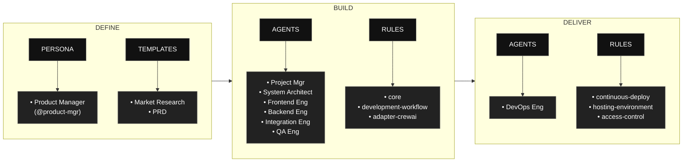

# AAMAD – AI-Assisted Multi-Agent Application Development Framework

**AAMAD** is an open, production-grade framework for building, deploying, and evolving multi-agent applications using best context engineering practices.  
It systematizes research-driven planning, modular AI agent workflows, and rapid MVP/devops pipelines for enterprise-ready AI solutions.

---

## Table of Contents

- [What is AAMAD?](#what-is-aamad)
- [AAMAD phases at a glance](#aamad-phases-at-a-glance)
- [Repository Structure](#repository-structure)
- [How to Use the Framework](#how-to-use-the-framework)
- [Phase 1: Define Workflow (Product Manager)](#phase-1-define-workflow-product-manager)
- [Phase 2: Build Workflow (Multi-Agent)](#phase-2-build-workflow-multi-agent)
- [Core Concepts](#core-concepts)
- [Contributing](#contributing)
- [License](#license)

---

## What is AAMAD?

AAMAD is a context engineering framework based on best practices in AI-assisted coding and multi-agent system development methodologies.  
It enables teams to:

- Launch projects with autonomous or collaborative AI agents
- Rapidly prototype MVPs with clear context boundaries
- Use production-ready architecture/design patterns
- Accelerate delivery, reduce manual overhead, and enable continuous iteration

---

## AAMAD phases at a glance

AAMAD organizes work into three phases: Define, Build, and Deliver, each with clear artifacts, personas, and rules to keep development auditable and reusable. 
The flow begins by defining context and templates, proceeds through multi‑agent build execution, and finishes with operational delivery.



- Phase 1: (Define)
    - Product Manager persona (`@product-mgr`) conducts prompt-driven discovery and context setup, supported by templates for Market Research Document (MRD) and Product Requirements Document (PRD), to standardize project scoping.

- Phase 2: (Build)
    - Multi‑agent execution by Project Manager, System Architect, Frontend Engineer, Backend Engineer, Integration Engineer, and QA Engineer, governed by core, development‑workflow, and CrewAI‑specific rules.

- Phase 3: (Deliver)
    - DevOps Engineer focuses on release and runtime concerns using rules for continuous deployment, hosting environment definitions, and access control.


---

## Repository Structure

    aamad/
    ├─ .cursor/
    │ ├─ agents/ # Agent persona markdown files (definitions & actions)
    │ ├─ prompts/ # Parameterized and phase-specific agent prompts
    │ ├─ rules/ # Architecture, workflow, and epics rules/patterns
    │ └─ templates/ # Generation templates for research, PRD, SAD, etc.
    ├─ project-context/
    │ ├─ 1.define/ # Project-specific PRD, SAD, research reports, etc.
    │ ├─ 2.build/ # Output artifacts for setup, frontend, backend, etc.
    │ └─ 3.deliver/ # QA logs, deploy configs, release notes, etc.
    ├─ CHECKLIST.md # Step-by-step execution guide
    └─ README.md # This file


**Framework artifacts** (in `.cursor/`) are reusable for any new project.  
**Project-context** contains all generated and instance-specific documentation for each app built with AAMAD.

---

## How to Use the Framework

1. **Clone this repository.**
   ```bash
   git clone https://github.com/synaptic-ai-consulting/AAMAD
   ```
2. Confirm `.cursor/` contains the full agent, prompt, and rule set.
3. Follow the `CHECKLIST.md` to run using multi-agent autonomy — typically, via CursorAI or another coding agent platform.
4. Each agent persona executes its epic(s), producing separate markdown artifacts and code as they go.
5. Review, test, and launch the MVP, then iterate or scale with additional features.

---

## Install via pip / uv

Instead of cloning, you can install the full artifact bundle from PyPI:

```bash
pip install aamad
# or
uv install aamad
```

After installation, run the CLI to copy the artifacts into your project:

```bash
aamad init --dest /path/to/your/project
```

Flags:
- `--dest PATH` (defaults to current directory)
- `--overwrite` (allow replacing existing files)
- `--dry-run` (preview what would be written)

You can inspect the package contents without extracting them via `aamad bundle-info --verbose`.

---

## Phase 1: Define Stage (Product Manager)

The Product Manager persona (`@product-mgr`) conducts prompt-driven discovery and context setup to standardize project scoping:

- **Market Research:** Generate Market Research Document (MRD) using `.cursor/templates/mrd-template.md`
- **Requirements:** Generate Product Requirements Document (PRD) using `.cursor/templates/prd-template.md`
- **Context Summary:** Create comprehensive context handoff artifacts for technical teams
- **Validation:** Ensure completeness of market analysis, user personas, feature requirements, and success metrics

Phase 1 outputs are stored in `project-context/1.define/` and provide the foundation for all subsequent development phases.

---

## Phase 2: Build Stage (Multi-Agent)

Each role is embodied by an agent persona, defined in `.cursor/agents/`.  
Phase 2 is executed by running each epic in sequence after completing Phase 1:

- **Architecture:** Generate solution architecture document (`sad.md`)
- **Setup:** Scaffold environment, install dependencies, and document (`setup.md`)
- **Frontend:** Build UI + placeholders, document (`frontend.md`)
- **Backend:** Implement backend, document (`backend.md`)
- **Integration:** Wire up chat flow, verify, document (`integration.md`)
- **Quality Assurance:** Test end-to-end, log results and limitations (`qa.md`)

Artifacts are versioned and stored in `project-context/2.build` for traceability.

---

## Core Concepts

- **Persona-driven development:** Each workflow is owned and documented by a clear AI agent persona with a single responsibility principle.
- **Context artifacts:** All major actions, decisions, and documentation are stored as markdown artifacts, ensuring explainability and reproducibility.
- **Parallelizable epics:** Big tasks are broken into epics, making development faster and more autonomous while retaining control over quality.
- **Reusability:** Framework reusable for any project—simply drop in your PRD/SAD and let the agents execute.
- **Open, transparent, and community-driven:** All patterns and artifacts are readable, auditable, and extendable.

---

## Contributing

Contributions are welcome!  
- Open an issue for bugs/feature ideas/improvements.
- Submit pull requests with extended templates, new agent personas, or bug fixes.
- Help evolve the knowledge base and documentation for greater adoption.
- When modifying `.cursor/` or `project-context/`, run `python scripts/update_bundle.py` to refresh the packaged artifact bundle before publishing.

---

## License

Licensed under Apache License 2.0.

> Why Apache-2.0
>    Explicit patent grant and patent retaliation protect maintainers and users from patent disputes, which is valuable for AI/ML methods, agent protocols, and orchestration logic.
>    Permissive terms enable proprietary or closed-source usage while requiring attribution and change notices, which encourages integration into enterprise stacks.
>    Compared to MIT/BSD, Apache-2.0 clarifies modification notices and patent rights, reducing legal ambiguity for contributors and adopters.

---

> For detailed step-by-step Phase 2 execution, see [CHECKLIST.md].  
> For advanced reference and prompt engineering, see `.cursor/templates/` and `.cursor/rules/`.

